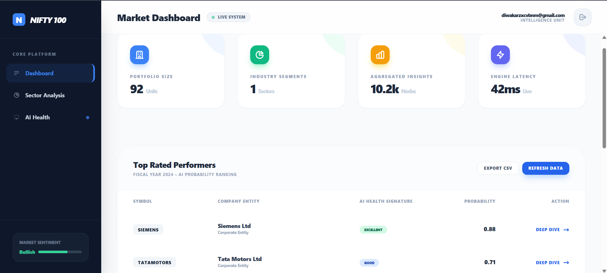
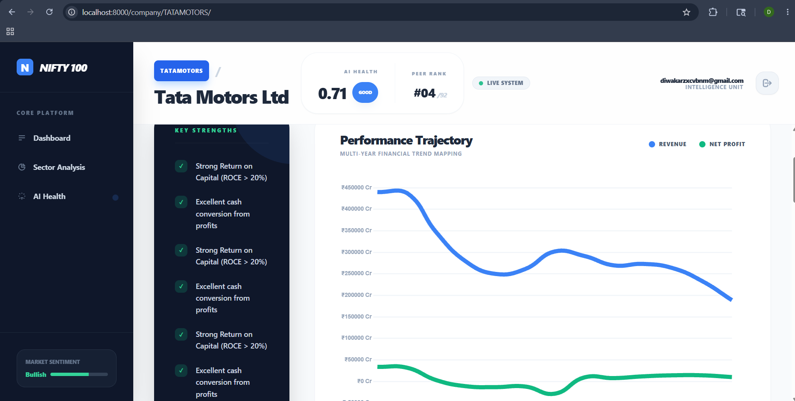
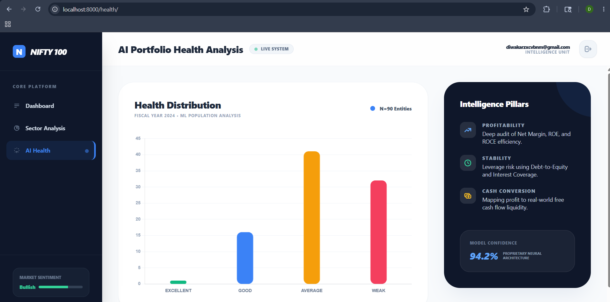
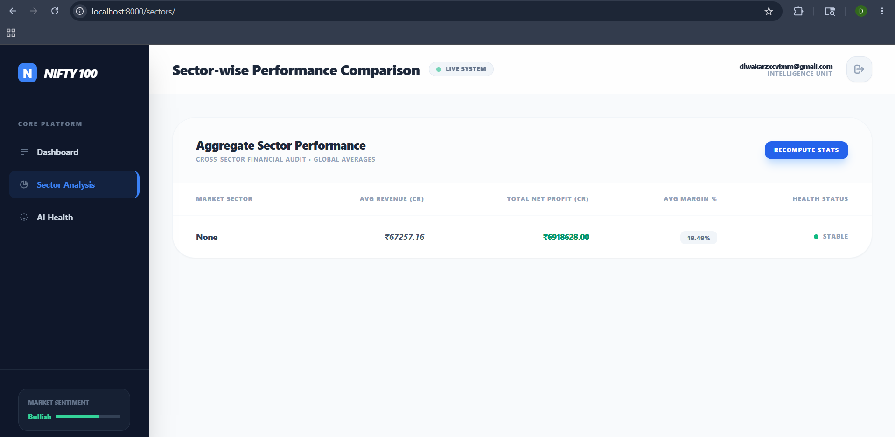
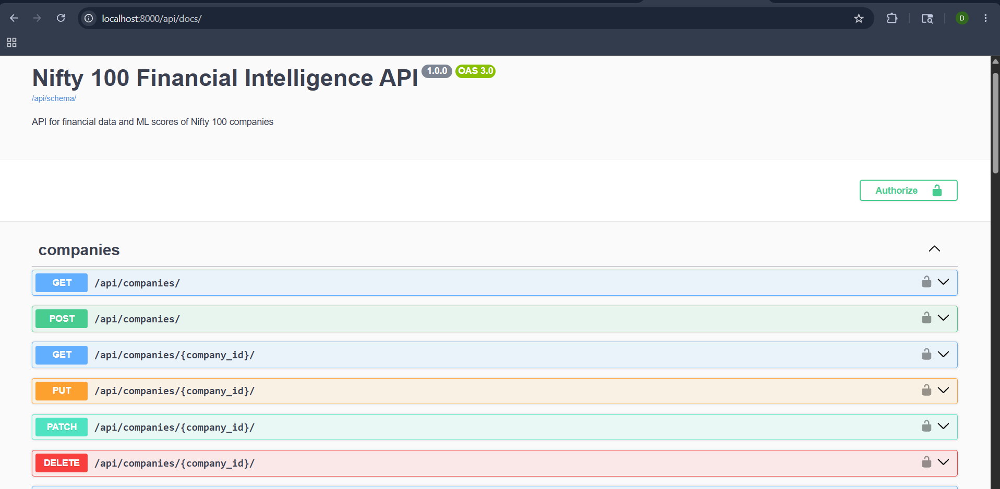
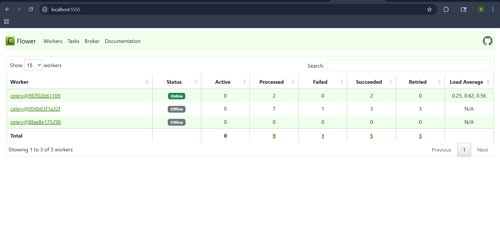

# Nifty 100 Financial Intelligence Platform


## Project Overview

The **Nifty 100 Financial Intelligence Platform** is a full-stack data engineering, analytics, and machine learning platform designed to track, analyze, and score the financial health of the top 100 companies listed on the NSE (National Stock Exchange of India). It provides actionable insights, historical trend analysis, and anomaly detection to assist investors and analysts in making data-driven decisions.

## Architecture

The platform follows a robust microservices architecture orchestrated by Docker Compose:

- **Web Server:** Nginx (Reverse Proxy & Static File Serving)
- **Application Server:** Gunicorn serving a Django REST Framework (DRF) application
- **Database:** PostgreSQL (Relational Data Warehouse)
- **Cache & Message Broker:** Redis
- **Background Processing:** Celery (Workers) & Celery Beat (Task Scheduler)
- **Monitoring:** Flower (Celery Task Monitoring)
- **ETL Pipeline:** Standalone Python scripts for data extraction, transformation, and database loading.
- **ML Engine:** Scikit-Learn based models for anomaly detection and financial scoring.



## Features

- **Automated ETL Pipeline:** Extracts raw financial statements (P&L, Balance Sheet, Cash Flow), cleans, transforms, and loads them into a normalized PostgreSQL dimensional schema.
- **Financial Health Scoring:** Machine learning models assign dynamic scores to companies based on profitability, liquidity, and operational efficiency.
- **Anomaly Detection:** Automatically flags unusual financial reporting or significant deviations from industry norms.
- **RESTful API:** Fully documented Swagger UI (`/api/schema/swagger-ui/`) for programmatically accessing sectors, companies, financials, and scores.
- **Background Tasks:** Asynchronous data processing, scraping, and ML model retraining handled by Celery.
- **Caching:** API endpoints and heavy database queries are cached via Redis for low latency.

## Screenshots

| Dashboard Overview | Company Deep Audit |
| :---: | :---: |
|  |  |

| AI Health Analytics | Sector Analysis |
| :---: | :---: |
|  |  |

| API Documentation | Task Monitoring (Flower) |
| :---: | :---: |
|  |  |

## Tech Stack

- **Backend:** Python 3.12, Django 6.0, Django REST Framework
- **Data Engineering:** Pandas, SQLAlchemy
- **Machine Learning:** Scikit-Learn, Numpy, SciPy
- **Infrastructure:** Docker, Docker Compose, PostgreSQL 15, Redis 7, Nginx
- **Task Queue:** Celery, Celery Beat, Flower
- **Deployment Ready:** Gunicorn, WhiteNoise

## Setup Instructions

### Prerequisites
- Docker and Docker Compose
- Git

### Installation

1. **Clone the repository:**
   ```bash
   git clone https://github.com/yourusername/nifty-financial-platform.git
   cd nifty-financial-platform
   ```

2. **Environment Variables:**
   Copy the example environment file and configure it (optional, defaults work for local dev):
   ```bash
   cp .env.example .env
   ```

3. **Start the Docker Stack:**
   ```bash
   docker compose up -d --build
   ```

4. **Verify Running Containers:**
   ```bash
   docker compose ps
   ```

5. **Run Migrations & Collect Static:**
   The `Dockerfile` handles `collectstatic` automatically. Database migrations are applied automatically by the web container startup (if configured) or can be run manually:
   ```bash
   docker compose exec web python manage.py migrate
   ```

6. **Run Initial ETL Pipeline:**
   Trigger the background ETL job to populate the database:
   ```bash
   docker compose exec worker python ../etl/03_load.py
   ```
   *(Or wait for the scheduled Celery Beat task).*

## API Documentation

Once the stack is running, you can access the interactive API documentation:
- **Swagger UI:** [http://localhost:8000/api/schema/swagger-ui/](http://localhost:8000/api/schema/swagger-ui/)
- **Redoc:** [http://localhost:8000/api/schema/redoc/](http://localhost:8000/api/schema/redoc/)

### Key Endpoints
- `GET /api/companies/` - List all Nifty 100 companies.
- `GET /api/financials/` - Access historical P&L, Balance Sheet, and Cash Flow data.
- `GET /api/scores/` - Retrieve the latest ML-driven financial health scores.
- `GET /api/sectors/` - Aggregate metrics by sector.

## ETL Pipeline Explanation

The ETL pipeline consists of three phases, orchestrated via `etl/03_load.py`:
1. **Extract:** Reads raw CSV/Excel dumps containing historical company data.
2. **Transform:** Normalizes column names, handles missing values (imputation), standardizes fiscal years, and pre-computes financial ratios (e.g., Net Profit Margin, Debt-to-Equity).
3. **Load:** Utilizes SQLAlchemy to perform Upserts (Insert on Conflict Update) into the PostgreSQL dimensional schema (`dim_company`, `dim_year`, `fact_profit_loss`, etc.).

## ML Scoring & Anomaly Detection

The `FinancialScoringEngine` (located in `scoring/`) utilizes historical data to:
- Normalize financial ratios across sectors using standard scalers.
- Apply Isolation Forests (or similar statistical methods) to flag anomalies.
- Generate a composite 0-100 "Financial Health Score" based on predefined weighted factors.
These tasks run asynchronously via Celery on a scheduled basis.

## Deployment Instructions

### Production Hardening
- **Debug Mode:** Ensure `DEBUG=False` in `.env`.
- **Allowed Hosts:** Set `ALLOWED_HOSTS` to your production domain(s) in `.env`.
- **Secret Key:** Generate a secure, unique `SECRET_KEY`.
- **Database Security:** Use strong passwords for PostgreSQL and Redis.

### Deploying to Render / Railway / VPS
1. **Render/Railway:** Use the provided `render.yaml` or connect your GitHub repository directly. They natively support `docker-compose` or `Dockerfile` deployments.
2. **VPS (Ubuntu/Debian):**
   - Install Docker and Docker Compose.
   - Clone the repo.
   - Set up your `.env`.
   - Run `docker compose -f docker-compose.yml up -d --build`.
   - Configure a domain to point to your VPS IP, and let the provided Nginx container route traffic on port 80 (or set up Certbot for HTTPS).

## License
Distributed under the MIT License. See `LICENSE` for more information.
